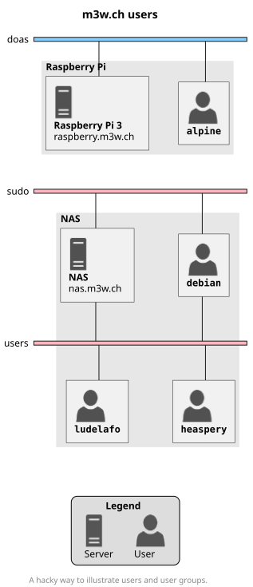

# m3w.ch

## Prerequisites

The following prerequisites must be filled to run these services:

- [Docker](https://docs.docker.com/get-docker/) must be installed.
- [Docker Compose](https://docs.docker.com/compose/install/) must be installed
  (it should be installed by default with Docker in most cases).

## Architecture




## Application configuration

Each application tries to follow the same structure and configuration:

1. **Set the environment variables**: Edit the `*.env` files to your needs.
2. **Run the application with Docker**: Run with `docker compose up --detach`.

## Cheatsheet

### Generate a secure password

```bash
# Generate a password for computers
pwgen --secure [--capitalize] [--numerals] [-symbols] 20 1

# Generate a password for humans
pwgen --ambiguous [--capitalize] [--numerals] [-symbols] 20 1
```
