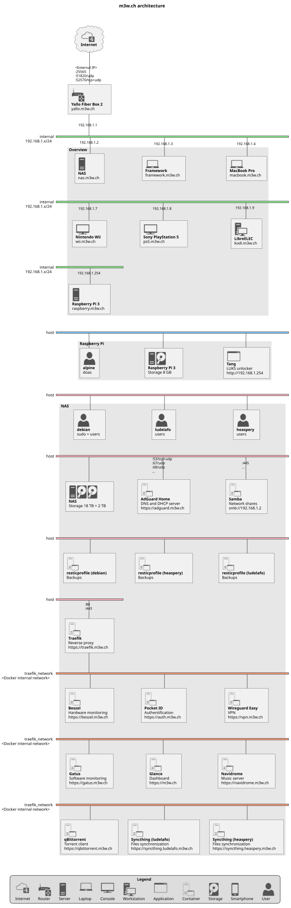

# m3w.ch

## Prerequisites

The following prerequisites must be filled to run these services:

- [Docker](https://docs.docker.com/get-docker/) must be installed.
- [Docker Compose](https://docs.docker.com/compose/install/) must be installed
  (it should be installed by default with Docker in most cases).

## Architecture

